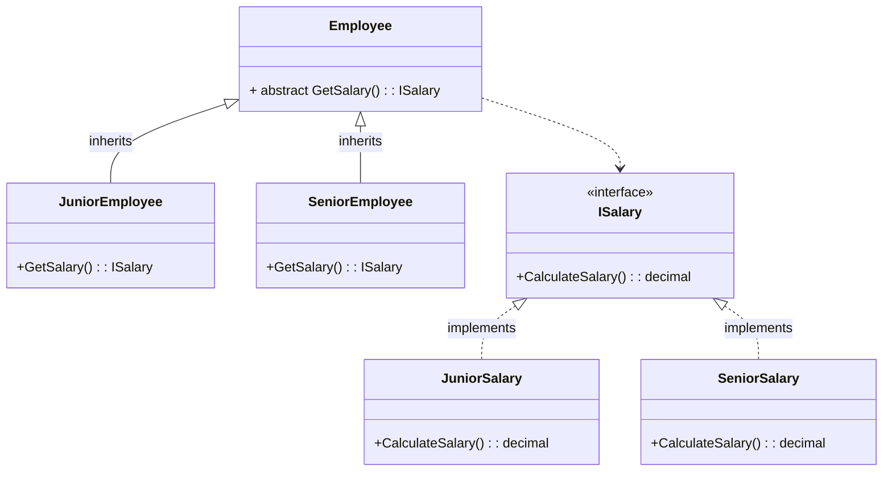

The objective of this post is to explain and show how to implement the Factory Pattern in a basic way.

## Pre-requisites
Check all the description and information related to the [Factory Pattern](/docs/creational-patterns/factory-method) and return here to see a practical example.

## Description

Suppose a company has different levels of employees: Junior, Mid-Level and Senior. 
Each level has a different base salary. We want to implement a system that calculates the salary of an employee according to his seniority.

<!--truncate-->

This idea can be visualized in the following diagram:



### Components of the Diagram

#### 1. **ISalary (Interface)**
- **Purpose**: Defines the common interface for salary objects.
- **Method**:
  - `CalculateSalary()`: A method that must be implemented by classes that implement this interface to calculate the salary.

#### 2. **JuniorSalary and SeniorSalary (Classes)**
- **Purpose**: Concrete implementations of the `ISalary` interface.
- **Method**:
  - `CalculateSalary()`: Implements the specific logic to calculate the base salary for a Junior and a Senior, respectively.

#### 3. **Employee (Abstract Class)**
- **Purpose**: Defines an abstract class representing an employee.
- **Method**:
  - `GetSalary()`: An abstract method that returns an object of type `ISalary`. This method will be implemented by derived classes to provide a specific `ISalary` implementation.

#### 4. **JuniorEmployee and SeniorEmployee (Classes)**
- **Purpose**: Concrete implementations of the abstract class `Employee`.
- **Method**:
  - `GetSalary()`: Implements the abstract `GetSalary()` method from the base `Employee` class, returning an instance of `JuniorSalary` or `SeniorSalary`, respectively.

### Objective in the Factory Method Pattern

The Factory Method pattern is used to encapsulate object creation logic. It allows a class to delegate the responsibility of object instantiation to its subclasses.

- **ISalary** and its implementations (`JuniorSalary` and `SeniorSalary`) define the products that the Factory Method will create.
  
- **Employee** acts as the abstract Creator class. It defines an interface to create an object (`ISalary` in this case) but leaves the implementation of how that object is created to the derived classes (`JuniorEmployee` and `SeniorEmployee`).

- **JuniorEmployee** and **SeniorEmployee** act as the ConcreteCreator classes. They implement the abstract `GetSalary()` method, which uses the Factory Method to create and return a concrete instance of `ISalary` (`JuniorSalary` or `SeniorSalary`).

By using the Factory Method pattern in this example, we achieve more modular and extensible code. If in the future we need to add a new salary type or employee type, we simply create new implementations of `ISalary` and `Employee` without modifying the existing code.

## Implementation 

```csharp
using System;

public interface ISalary
{
    decimal CalculateSalary();
}

public class JuniorSalary : ISalary
{
    public decimal CalculateSalary()
    {
        return 30000;  
    }
}

public class SeniorSalary : ISalary
{
    public decimal CalculateSalary()
    {
        return 80000;  
    }
}

public abstract class Employee
{
    public abstract ISalary GetSalary();
}

public class JuniorEmployee : Employee
{
    public override ISalary GetSalary()
    {
        return new JuniorSalary();
    }
}

public class SeniorEmployee : Employee
{
    public override ISalary GetSalary()
    {
        return new SeniorSalary();
    }
}

class Program
{
    static void Main(string[] args)
    {
        // Create instances of JuniorEmployee and SeniorEmployee
        Employee juniorEmployee = new JuniorEmployee();
        Employee seniorEmployee = new SeniorEmployee();

        // Get salaries for Junior and Senior Employees
        ISalary juniorSalary = juniorEmployee.GetSalary();
        ISalary seniorSalary = seniorEmployee.GetSalary();

        // Print salaries
        Console.WriteLine($"The salary for a Junior Employee is: {juniorSalary.CalculateSalary():C}");
        Console.WriteLine($"The salary for a Senior Employee is: {seniorSalary.CalculateSalary():C}");
    }
}
```