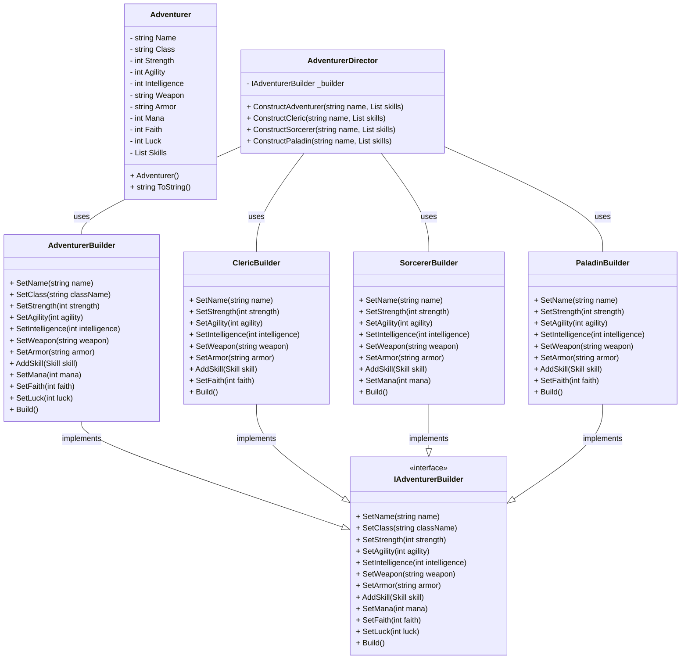

<div align="center">
    
    <p>Image made by <a href="https://www.deviantart.com/piercless/art/Konosuba-Gang-786187948">piercless</a></p>
</div>

The objective of this post is to explain and show how to implement the Builder Pattern in a basic way.

## Pre-requisites
Check all the description and information related to the [Builder Pattern](/docs/creational-patterns/builder) and return here to see a practical example.

## Description

In the world of Konosuba, building an effective adventuring party is no easy feat!  You need to consider various roles,  attributes, and maybe even questionable quirks. The Builder pattern provides a flexible solution to create personalized adventurers.

<!--truncate-->

## The Problem: Character Sheets Get Messy

Imagine trying to create a character with a single constructor call:

```csharp
Character kazuma = new Character("Kazuma", "Adventurer", 5, 15, 10, "Dagger", null, "Steal");
```

Is Kazuma a fighter, rogue, or just lucky?, As characters gain specializations and equipment, 
it becomes difficult to manage everything in one constructor.

## The Builder Solution

* Builder Interface: Define an AdventurerBuilder interface with methods like `setName()`, `setClass()`, `setStrength()`, `setAgility()`, `setSkill()`, etc.
* Concrete Builders: Specialized builders like NoviceBuilder, FighterBuilder, or even WeirdoBuilder (for a certain someone...) could implement this interface.
* Director (Optional): A Guildmaster class could act as a Director, encapsulating the steps for creating common party roles like Archer, Healer, and Explosion enthusiast.

## Pros

* Separation of Concerns: The Builder pattern separates the construction of a complex object from its representation, allowing the same construction process to create different representations.
* Complex Object Creation: It simplifies the process of creating complex objects by breaking down the construction steps into smaller, manageable methods. This makes the code easier to read, understand, and maintain.
* Reusability: Builders can be reused to create similar objects with different configurations, reducing code duplication and promoting code reuse.
* Flexibility: Builders allow for the construction of objects using different configurations or variations, giving flexibility to the client code to create objects with varying attributes.
* Encapsulation: It encapsulates the construction process within the Builder class, hiding the details of object creation from the client code.

## Cons

* Overhead: The Builder pattern introduces additional classes and interfaces, which can lead to increased code complexity, especially for simpler objects where the overhead may not be justified.
* Potential for Error: Since the client code must explicitly invoke the builder methods to construct an object, there's a risk of missing or misordering the method calls, leading to runtime errors.
* Limited Scope: The Builder pattern is most beneficial for creating complex objects with many configuration options. For simpler objects, the overhead of using a builder may outweigh its benefits.

## Code example

<iframe width="100%" height="475" src="https://dotnetfiddle.net/Widget/TBmTXW" frameborder="0"></iframe>

[SourceCode](https://github.com/lbte/design-patterns/tree/main/code/creational-patterns/builder)

This code implementation was inspired by the skill card system featured in the anime 'Konosuba.' 
Each character, including Aqua, Kazuma, Megumin, and Darkness, is represented with their unique attributes, 
skills, and equipment, akin to how they are portrayed in the series.


[Image taken from konosuba fandom](https://konosuba.fandom.com/wiki/Skills)

### Diagram



## Conclusion 

The Builder design pattern is a powerful tool for creating complex objects with configurable attributes
and variations. It offers several benefits such as separation of concerns, simplification of complex object 
creation, reusability, flexibility, and encapsulation of construction processes. However, like any design pattern, 
it also comes with its drawbacks, including potential overhead, increased code complexity, and the risk of errors if not used appropriately.

When deciding whether to use the Builder pattern, it's essential to consider the complexity of the objects being created,
the variability in their attributes, and the potential for reuse. For complex objects with many configuration options and
variations, the Builder pattern can significantly improve code readability, maintainability, and flexibility. However,
for simpler objects or situations where the construction process is straightforward, using the Builder pattern may
introduce unnecessary overhead and complexity.