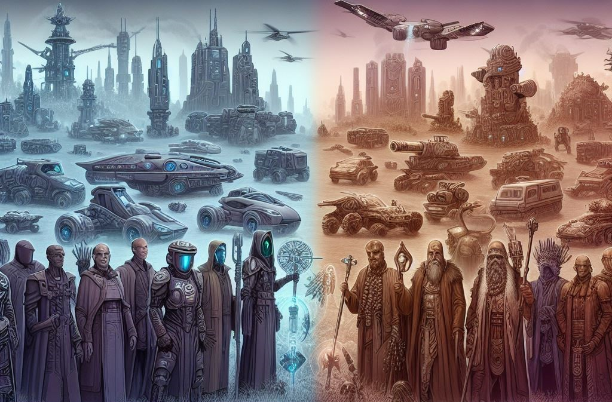
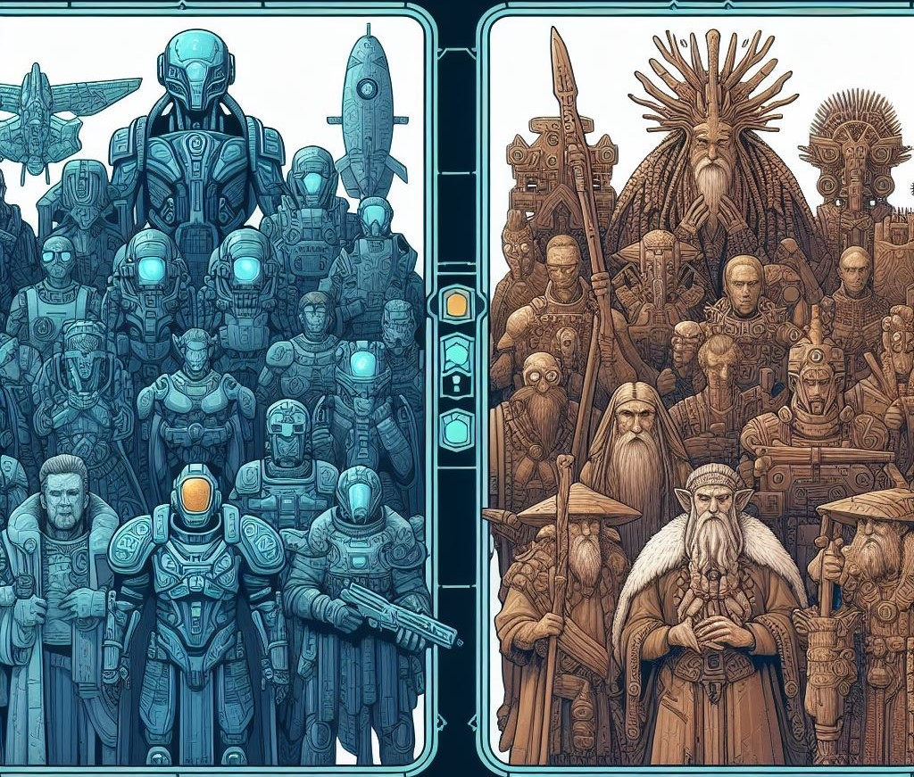
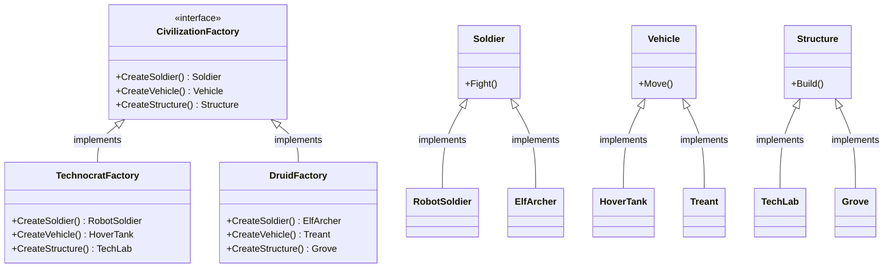

The objective of this post is to explain and show how to implement the Abstract Factory Pattern in a basic way.

## Pre-requisites
Check all the description and information related to the [Abstract Factory Pattern](/docs/creational-patterns/abstract-factory) and return here to see a practical example.

## Description

You're crafting an immersive gaming experience where players are transported to a vibrant world filled with diverse civilizations. 
Two of these civilizations stand out: the Technocrats, with their sleek, futuristic technology, and the Druids, guardians of ancient wisdom and nature's secrets.

<!--truncate-->

As players embark on their adventure, they're faced with a pivotal choice: which civilization to align themselves with? 
The decision isn't just about aesthetics; it fundamentally shapes their gameplay experience. 
Each civilization offers a unique set of units tailored to their ethos and worldview.

For the Technocrats, innovation is paramount. Their armies boast cutting-edge robotic soldiers, hover tanks that glide effortlessly over terrain, 
and high-tech research facilities that push the boundaries of science and engineering.

Conversely, the Druids draw their strength from the natural world. Their ranks swell with agile elf archers, 
towering treants that lumber through forests as living fortresses, and mystical groves where the very essence of nature is harnessed to defend their lands.



As the game progresses, players strategize, building their armies and civilizations to conquer foes and secure victory.

With each civilization offering its own distinct units, how do you, the game developer, efficiently implement object creation? 
Without a clear strategy, the codebase threatens to spiral into chaos.

So in order to solve this problem we decide to allow the Abstract Factory Pattern to help us. 

## How to implement

1. Map out a matrix of distinct product types versus variants of these products.

2. Declare abstract product interfaces for all product types. Then make all concrete product classes implement these interfaces.

3. Declare the abstract factory interface with a set of creation methods for all abstract products.

4. Implement a set of concrete factory classes, one for each product variant.

5. Create factory initialization code somewhere in the app. It should instantiate one of the concrete factory classes, depending on the application configuration or the current environment. Pass this factory object to all classes that construct products.

This idea can be visualized in the following diagram:



### Components of the Diagram

1. **CivilizationFactory**: This represents the abstract factory interface or class. It defines the methods for creating families of related objects, such as soldiers, vehicles, and structures. In the context of the game, it abstracts the creation of units for different civilizations.

2. **TechnocratFactory**: This is a concrete factory implementation that extends the `CivilizationFactory` interface. It provides the implementation for creating objects related to the Technocrat civilization, including `RobotSoldier`, `HoverTank`, and `TechLab`.

3. **DruidFactory**: Similar to `TechnocratFactory`, `DruidFactory` is another concrete factory implementation that extends the `CivilizationFactory` interface. It encapsulates the creation logic for objects associated with the Druid civilization, such as `ElfArcher`, `Treant`, and `Grove`.

4. **Soldier, Vehicle, Structure**: These are product interfaces or abstract classes representing the types of objects created by the factories. They define the common methods or properties shared by all concrete product implementations.

5. **RobotSoldier, ElfArcher, HoverTank, Treant, TechLab, Grove**: These are concrete product implementations that represent specific instances of soldiers, vehicles, and structures. Each concrete factory is responsible for creating objects of these types according to the civilization it represents.

## Implementation in C#

### Abstract Products

```csharp
// Abstract Product Interfaces
public interface Soldier
{
    void Fight();
}

public interface Vehicle
{
    void Move();
}

public interface Structure
{
    void Build();
}
```

### Concrete Products

```csharp
// Concrete Product Implementations
public class RobotSoldier : Soldier
{
    public void Fight()
    {
        Console.WriteLine("Robot Soldier fights with precision and strength.");
    }
}

public class ElfArcher : Soldier
{
    public void Fight()
    {
        Console.WriteLine("Elf Archer attacks swiftly with deadly accuracy.");
    }
}

public class HoverTank : Vehicle
{
    public void Move()
    {
        Console.WriteLine("Hover Tank glides gracefully across the battlefield.");
    }
}

public class Treant : Vehicle
{
    public void Move()
    {
        Console.WriteLine("Treant moves with the strength of nature, crushing obstacles in its path.");
    }
}

public class TechLab : Structure
{
    public void Build()
    {
        Console.WriteLine("Tech Lab constructs advanced machinery and weaponry.");
    }
}

public class Grove : Structure
{
    public void Build()
    {
        Console.WriteLine("Grove nurtures life, fostering harmony with nature.");
    }
}
```

### Abstract Factory and Concrete factories

```csharp
// Abstract Factory
public interface ICivilizationFactory
{
    Soldier CreateSoldier();
    Vehicle CreateVehicle();
    Structure CreateStructure();
}

// Concrete Factory for Technocrats
public class TechnocratFactory : ICivilizationFactory
{
    public Soldier CreateSoldier() => new RobotSoldier();
    public Vehicle CreateVehicle() => new HoverTank();
    public Structure CreateStructure() => new TechLab();
}

// Concrete Factory for Druids
public class DruidFactory : ICivilizationFactory
{
    public Soldier CreateSoldier() => new ElfArcher();
    public Vehicle CreateVehicle() => new Treant();
    public Structure CreateStructure() => new Grove();
}   
```

### Client code to create civilizations

```csharp
// Choose the civilization
ICivilizationFactory factory = new TechnocratFactory(); // Or new DruidFactory();

// Create objects using the factory
Soldier soldier = factory.CreateSoldier();
Vehicle vehicle = factory.CreateVehicle();
Structure structure = factory.CreateStructure();

soldier.Fight();
vehicle.Move();
structure.Build();
```

## Conclusion

In conclusion, the Abstract Factory pattern offers a powerful solution for creating families of related objects in a modular and extensible manner. 
When implementing this pattern, it's essential to consider the following key points:

1. **Abstraction**: Define abstract interfaces or classes for factories and products to promote flexibility and decouple client code from concrete implementations.

2. **Concrete Implementations**: Provide concrete factory implementations for each family of related objects, ensuring they adhere to the abstract factory interface.

3. **Product Families**: Organize objects into families based on common themes or characteristics, allowing for easy swapping of entire sets of related objects.

4. **Scalability**: Design the pattern to accommodate future growth and evolution by allowing for easy addition of new product types or families.

5. **Client Usage**: Encapsulate object creation logic within factories, minimizing dependencies and promoting clean client code that focuses on interacting with abstract interfaces.
