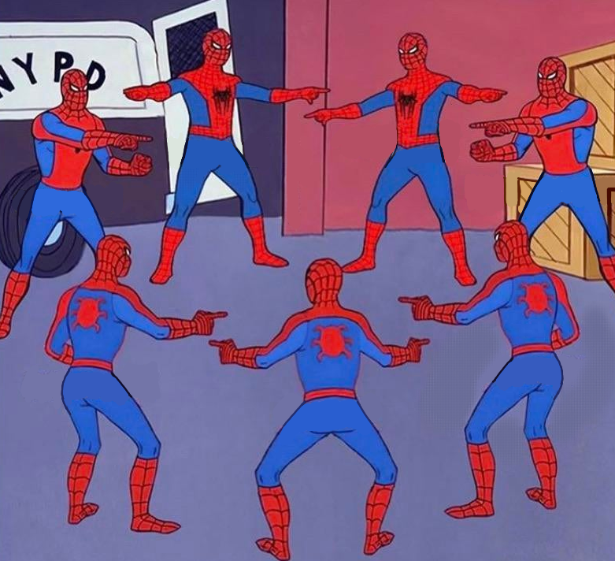
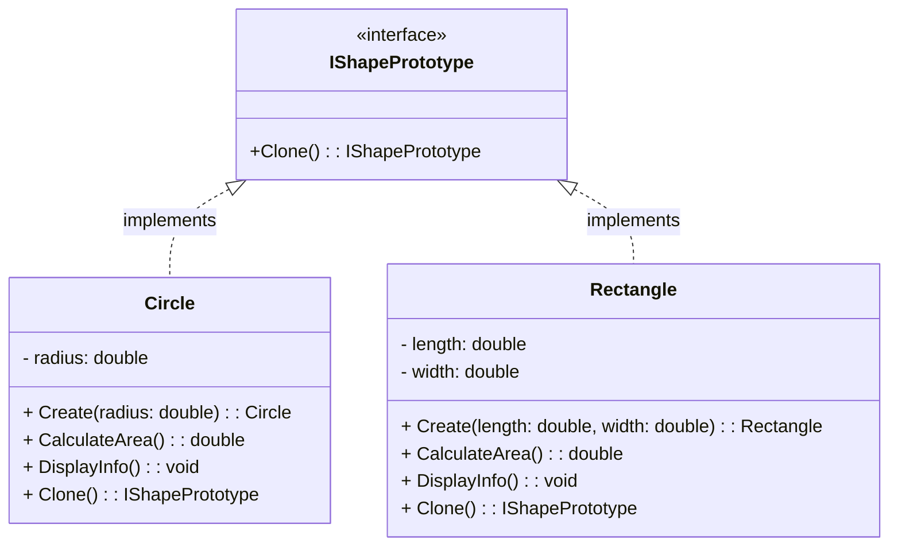

The objective of this post is to explain and show how to implement the Prototype Pattern in a basic way.

## Pre-requisites

Check all the description and information related to the [Prototype Pattern](/docs/creational-patterns/prototype) and return here to see a practical example.

## Description

Let's suppose that we are using a graphic design tool like Adobe Illustrator or Sketch.

In these applications, users often create complex graphical objects like icons, logos, or illustrations, 
which can have various configurations and styles. 
Rather than creating each graphical object from scratch every time a user wants to use it, 
the Prototype Pattern can be employed to clone existing objects.

<!--truncate-->

## Implementation

### Interface Prototype
In the application, there is an interface or abstract class called `GraphicPrototype` that defines the `clone()` method. 
This method is responsible for creating a copy of the object.

### Concrete Prototypes
There are concrete classes such as `Circle`, `Rectangle`, and `Polygon`, each representing different types of graphical objects.
Each concrete class implements the `GraphicPrototype` interface and provides its own implementation of the `clone()` method.
This method creates a new instance of the object and copies its state, including attributes like color, size, and position.



```csharp
using System;

public interface IShapePrototype
{
    IShapePrototype Clone();
}

public class Circle : IShapePrototype
{
    private double radius;

    private Circle(double radius)
    {
        this.radius = radius;
    }

    public static Circle Create(double radius)
    {
        return new Circle(radius);
    }

    private double CalculateArea()
    {
        return Math.PI * radius * radius;
    }

    public void DisplayInfo()
    {
        Console.WriteLine($"Circle - Radius: {radius}, Area: {CalculateArea()}");
    }

    public IShapePrototype Clone()
    {
        return Circle.Create(this.radius);
    }
}

public class Rectangle : IShapePrototype
{
    private double length;
    private double width;

    private Rectangle(double length, double width)
    {
        this.length = length;
        this.width = width;
    }

    public static Rectangle Create(double length, double width)
    {
        return new Rectangle(length, width);
    }

    private double CalculateArea()
    {
        return length * width;
    }

    public void DisplayInfo()
    {
        Console.WriteLine($"Rectangle - Length: {length}, Width: {width}, Area: {CalculateArea()}");
    }

    public IShapePrototype Clone()
    {
        return Rectangle.Create(this.length, this.width);
    }
}

class Program
{
    static void Main(string[] args)
    {
        // Create prototype objects
        Circle circlePrototype = Circle.Create(5);
        Rectangle rectanglePrototype = Rectangle.Create(4, 6);

        // Clone objects
        Circle clonedCircle = (Circle)circlePrototype.Clone();
        Rectangle clonedRectangle = (Rectangle)rectanglePrototype.Clone();

        // Display info
        clonedCircle.DisplayInfo();
        clonedRectangle.DisplayInfo();
    }
}
```

<iframe width="100%" height="475" src="https://dotnetfiddle.net/Widget/Ra98F7" frameborder="0"></iframe>
