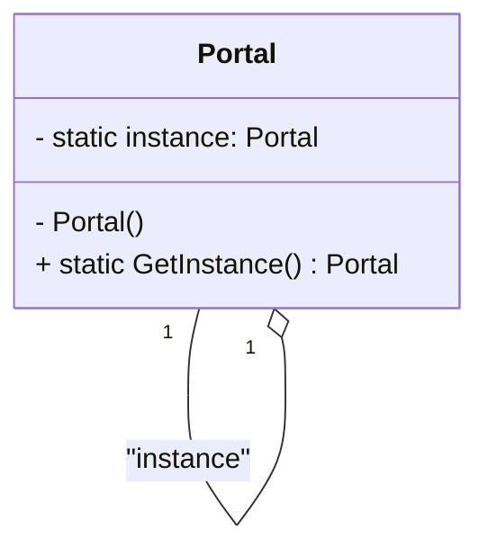

The objective of this post is to explain and show how to implement the Singleton Pattern in a basic way.

## Pre-requisites
Check all the description and information related to the [Singleton Pattern](/docs/creational-patterns/singleton) and return here to see a practical example.

## Description

In your immersive fantasy game, players embark on epic quests across mystical realms, each connected by magical portals. These portals serve as gateways between worlds, allowing adventurers to traverse vast landscapes, encounter mythical creatures, and uncover ancient treasures.

However, there's a problem lurking in the enchanted fabric of your game world: every time a new portal object is created, 
a new portal springs into existence. 
This seemingly innocuous behavior soon spirals into chaos as the game progresses:
<!--truncate-->

* **Players Getting Lost:** With countless portals appearing throughout the game world, players find themselves disoriented and lost, unsure which portal leads where. The once-clear paths between realms become a labyrinth of confusion and frustration.
* **Worlds Colliding:** As more portals materialize, the boundaries between realms blur, leading to unintended crossover events. Players may find themselves unexpectedly transported to unfamiliar lands, encountering enemies or challenges meant for higher levels.

To address this dilemma, you need a solution that ensures there's only one instance of the magical portal class throughout your game.

## How to implement

1. **Private Constructor:** Create a private constructor to prevent external instantiation of the class.
2. **Static Instance Variable:** Declare a private static variable to hold the single instance of the class.
3. **Static Method for Instance Access:** Create a public static method to provide access to the single instance, 
creating it if necessary.
4. **Lazy Initialization (Optional):** Consider lazy initialization to create the instance only when it's first requested. 
This can improve performance by delaying instance creation until it's actually needed.
5. **Thread Safety (Optional):** Ensure thread safety if your application is multithreaded, using synchronization techniques.
6. **Additional Considerations:** Handle initialization parameters, prevent cloning or serialization, or implement a static destructor as needed.

This idea can be visualized in the following diagram:

<div align="center">

</div>

## Implementation in C#

```csharp
using System;

public class Portal
{
    private static Portal instance;

    // Private constructor to prevent external instantiation
    private Portal() 
    {
        Console.WriteLine("Portal instance created!");
    }

    // Static method to provide access to the single instance
    public static Portal GetInstance()
    {
        // Lazy initialization: create the instance only when it's first requested
        if (instance == null)
        {
            instance = new Portal();
        }
        return instance;
    }

    public void OpenPortal()
    {
        Console.WriteLine("Portal opened!");
    }
}

class Program
{
    static void Main(string[] args)
    {
        // Accessing the Singleton instance
        Portal portal1 = Portal.GetInstance();
        Portal portal2 = Portal.GetInstance();

        // Both portal1 and portal2 should refer to the same instance
        Console.WriteLine($"Is portal1 the same instance as portal2? {portal1 == portal2}");

        // Using the Singleton instance to open a portal
        portal1.OpenPortal();
    }
}

```

* The ``Portal`` class represents the Singleton, ensuring that there's only one instance of ``Portal`` throughout the application.
* The ``GetInstance()`` method provides access to the single instance of ``Portal``, creating it if necessary using lazy initialization.
* The ``OpenPortal()`` method simulates an action performed by the ``Portal``.
* In the Main method, we demonstrate that multiple calls to ``GetInstance()`` return the same instance of ``Portal``.
* Finally, we use the ``Portal`` instance to perform an action (``OpenPortal()``).

When you run this program, you'll see that only one instance of ``Portal`` is created, and both ``portal1`` and ``portal2`` refer to the same instance.