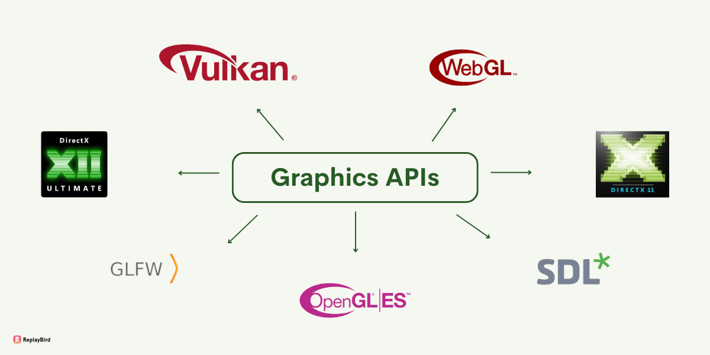
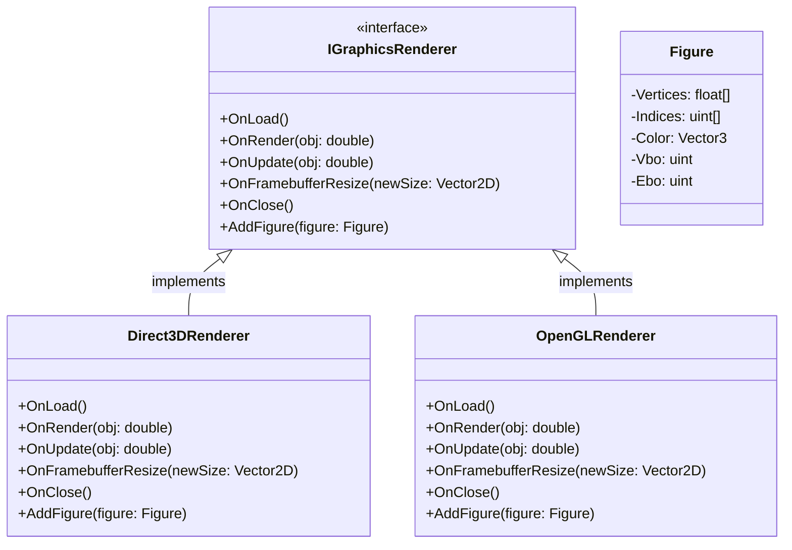
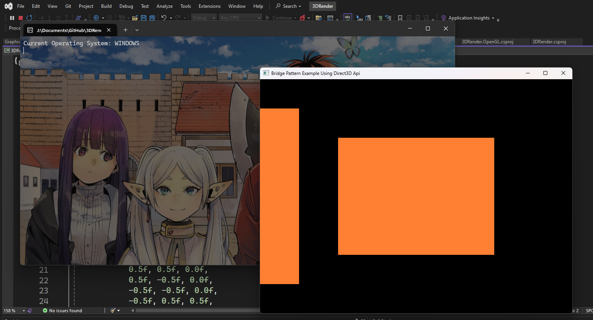
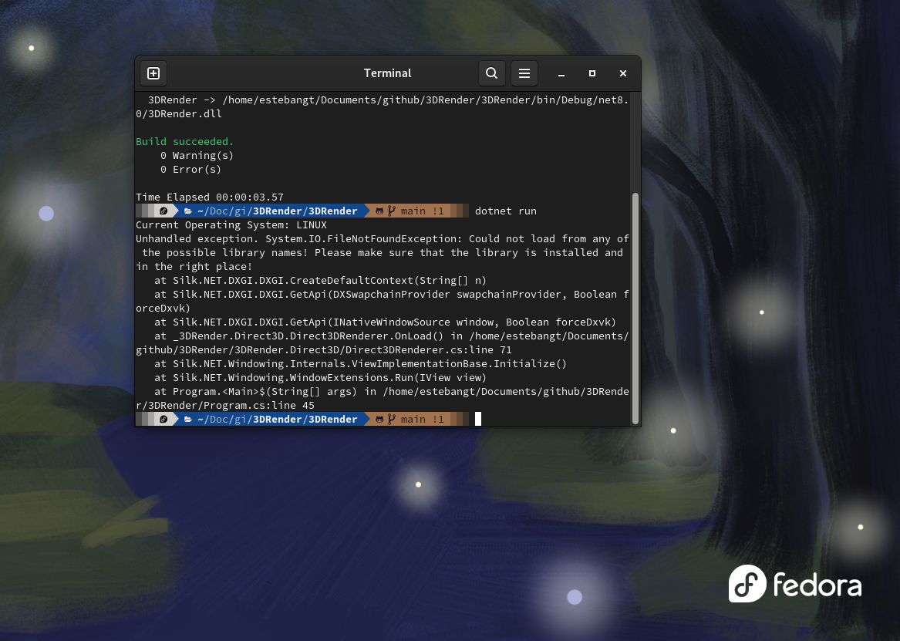
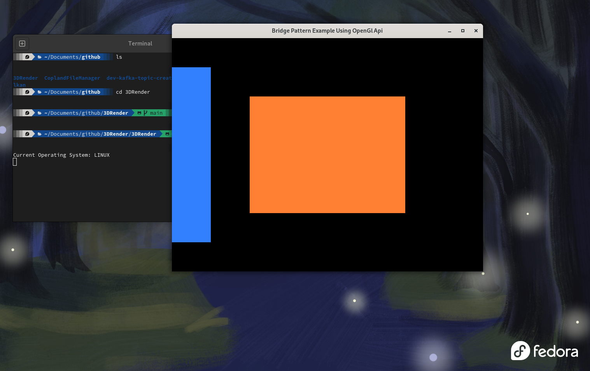

<div align="center">
  
  <p>Image taken from <a href="https://blog.replaybird.com/graphic-apis-best-alternatives/">ReplayBird</a></p>
</div>

The objective of this post is to explain and show how to implement the Bridge pattern

## Pre-requisites

Check all the description and information related to the [Bridge Pattern](/docs/structural-patterns/bridge) and return here to see a practical example.

## Description

Imagine that you are creating a new graphics engine and this engine needs to be able to run on the different operating systems Like `Windows`, `Linux` and `OSX`.

As you delve deeper into the development process, you encounter a significant hurdle: the diverse Graphics APIs supported by each operating system. 
Your initial approach involves creating separate classes to implement the functionality for each Graphics API, resulting in `DirectxApi`, `OpenGlApi`, and `VulkanApi`.
However, as your codebase grows, maintaining these distinct classes becomes increasingly unwieldy.

With the Bridge Pattern, you're presented with an elegant solution to this conundrum. By adopting the Bridge Pattern, you can effectively separate the abstraction of the
graphics functionality from the platform-specific implementations. Let's explore how the Bridge Pattern transforms your approach and mitigates the challenges of managing a growing codebase.

<!--truncate-->

## Before implementing this pattern

Start defining an abstraction layer that encapsulates the high-level graphics functionality your engine provides.
This abstraction serves as a contract between the client code and the platform-specific implementations, allowing for seamless interaction without exposing the underlying complexities.

Next, you create platform-specific implementation classes, such as `OpenGLRenderer`, `Direct3DRenderer`, and `VulkanRenderer`, each tailored to interact with the respective operating system's Graphics API.
These implementation classes adhere to the common interface defined by the abstraction layer, ensuring interchangeable compatibility.

## Adapting to Growth

As your graphics engine evolves and grows in complexity, the Bridge Pattern offers unparalleled flexibility and scalability. Adding support for new operating systems or Graphics APIs becomes a streamlined process
of creating additional implementation classes that adhere to the existing abstraction. This modular approach minimizes code duplication and promotes code reuse, simplifying maintenance and future expansion efforts.

Furthermore, the Bridge Pattern facilitates code maintainability by isolating changes to specific implementation details, preventing ripple effects throughout the codebase. Whether you're optimizing performance for
a specific platform or integrating new features, the Bridge Pattern empowers you to make targeted modifications without disrupting the overall architecture.

## Code Implementation

To implement the pattern we need to create an interface that has the common methods that our code needs to work, this interface helps us to create platform specific implementation

```csharp
public interface IGraphicsRenderer
{
    unsafe void OnLoad();
    unsafe void OnRender(double obj);
    void OnUpdate(double obj);
    void OnFramebufferResize(Vector2D<int> newSize);
    void OnClose();
    void AddFigure(Figure figure);
}
```

with this implementation we can create our `Direct3DRenderer` or `OpenGLRenderer`

:::note

Please visit the source code for the custom implementations
* [Direct3DRenderer](https://github.com/egonzalezt/3DRender/blob/main/3DRender.Direct3D/Direct3DRenderer.cs)
* [OpenGLRenderer](https://github.com/egonzalezt/3DRender/blob/main/3DRender.OpenGL/OpenGLRenderer.cs)
:::

At this point we have the main functionality done, but we can create our Abstraction which defines the high-level interface for clients to interact with our engine [GraphicsAbstraction](https://github.com/egonzalezt/3DRender/blob/main/3DRender/GraphicsAbstraction.cs)

[SourceCode](https://github.com/egonzalezt/3DRender)
### Diagram



### Result

Running the application on `Windows` will use `Direct3D` by default

<div align="center">
    [](./windows.png)
</div>

but what happens if we run this application on `Linux` and force the system to use `Direct3D` instead of `OpenGL`?

In this scenario we are going to use **[Linux Fedora 40 workstation](https://www.fedoraproject.org/workstation/)** to run this code

<div align="center">
  [](./direct3DLinux.png)
</div>

As you can see it is not possible to run Direct3D on `Linux` because it is designed to run on `Windows`

> *Microsoft DirectX is a collection of application programming interfaces for handling tasks related to multimedia, especially game programming and video, on **Microsoft platforms.***
> — Source: [Wikipedia](https://en.wikipedia.org/wiki/DirectX)

This is where the Bridge pattern comes into play, you can have multiple implementations of the same interface but the result is the same, the expected result is to see the same figures that you see on `Windows` but in this case using `OpenGL` and running on `Linux`.

<div align="center">
  [](./linux.png)
</div>

## References

* [Bridge](https://refactoring.guru/design-patterns/bridge)
* [OpenGL](https://www.opengl.org/)
* [DirectX graphics and gaming](https://learn.microsoft.com/en-us/windows/win32/directx)
* [Silk.NET](https://github.com/dotnet/Silk.NET)
* [Silk.NET Examples](https://github.com/dotnet/Silk.NET/tree/main/examples/CSharp)
* [Best Graphic APIs and their Alternatives](https://blog.replaybird.com/graphic-apis-best-alternatives/)