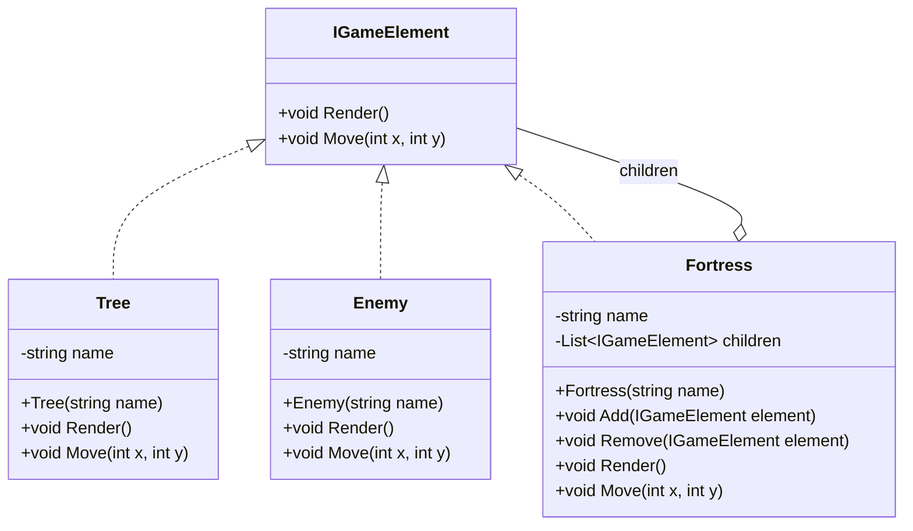

<div align="center">
    
</div>

The objective of this post is to explain and show how to implement the Composite Pattern in a basic way.

## Pre-requisites
Check all the description and information related to the [Composite Pattern](/docs/structural-patterns/composite) and return here to see a practical example.

## Description

Imagine you're developing a game where players can build and customize their own game levels. Each level can contain various elements like buildings, trees, and enemies. Some elements are simple (like a single tree), while others are complex (like a fortress composed of walls, towers, and gates). Players should be able to interact with these elements uniformly, whether they are single items or complex structures.

<!--truncate-->

Handling this hierarchy without a structured approach can quickly become unwieldy. You might end up writing repetitive, conditional code to manage different types of elements, leading to a tangled and hard-to-maintain codebase.

The Composite pattern allows us to treat individual game elements and groups of elements uniformly. By defining a common interface for all elements, both simple and complex, we can perform operations on them without worrying about their specific types.

In order to implement this pattern follow these steps:

### Step 1: Define the Component Interface

```csharp
public interface IGameElement
{
    void Render();
    void Move(int x, int y);
}
```

### Step 2: Implement Leaf Classes (Simple Elements)

These classes must implement the Component Interface.

```csharp
public class Tree : IGameElement
{
    private string name;

    public Tree(string name)
    {
        this.name = name;
    }

    public void Render()
    {
        Console.WriteLine($"Rendering Tree: {name}");
    }

    public void Move(int x, int y)
    {
        Console.WriteLine($"Moving Tree {name} to ({x}, {y})");
    }
}

public class Enemy : IGameElement
{
    private string name;

    public Enemy(string name)
    {
        this.name = name;
    }

    public void Render()
    {
        Console.WriteLine($"Rendering Enemy: {name}");
    }

    public void Move(int x, int y)
    {
        Console.WriteLine($"Moving Enemy {name} to ({x}, {y})");
    }
}
```

### Step 3: Implement the Composite Class (Complex Elements)

```csharp
using System.Collections.Generic;

public class Fortress : IGameElement
{
    private string name;
    private List<IGameElement> children = new List<IGameElement>();

    public Fortress(string name)
    {
        this.name = name;
    }

    public void Add(IGameElement element)
    {
        children.Add(element);
    }

    public void Remove(IGameElement element)
    {
        children.Remove(element);
    }

    public void Render()
    {
        Console.WriteLine($"Rendering Fortress: {name}");
        foreach (var child in children)
        {
            child.Render();
        }
    }

    public void Move(int x, int y)
    {
        Console.WriteLine($"Moving Fortress {name} to ({x}, {y})");
        foreach (var child in children)
        {
            child.Move(x, y);
        }
    }
}
```
### Step 4: Assemble the Game Level

```csharp
class Program
{
    static void Main(string[] args)
    {
        // Create simple elements
        IGameElement tree1 = new Tree("Tree 1");
        IGameElement enemy1 = new Enemy("Enemy 1");

        // Create a complex element and add simple elements to it
        Fortress fortress1 = new Fortress("Fortress 1");
        fortress1.Add(tree1);
        fortress1.Add(enemy1);

        // Create another simple element
        IGameElement tree2 = new Tree("Tree 2");

        // Create a top-level composite and add both simple and complex elements
        Fortress gameLevel = new Fortress("Game Level");
        gameLevel.Add(fortress1);
        gameLevel.Add(tree2);

        // Render and move all elements in the game level
        gameLevel.Render();
        gameLevel.Move(10, 20);
    }
}
```

In order to see the result of the code above, you can run the following code snippet:

<iframe width="100%" height="475" src="https://dotnetfiddle.net/Widget/lQH8By" frameborder="0"></iframe>

### Diagram

Here you can see a class diagram related to the code explained above:



## Conclusion 

The Composite pattern is perfect for designing complex hierarchical structures in game development, such as customizable game levels. It allows for uniform treatment of individual game elements and groups of elements, simplifying interaction and management. By using a common interface (IGameElement), the code remains clean, flexible, and maintainable, making it easy to extend and modify the game level as needed. This leads to a more robust and scalable game architecture.
