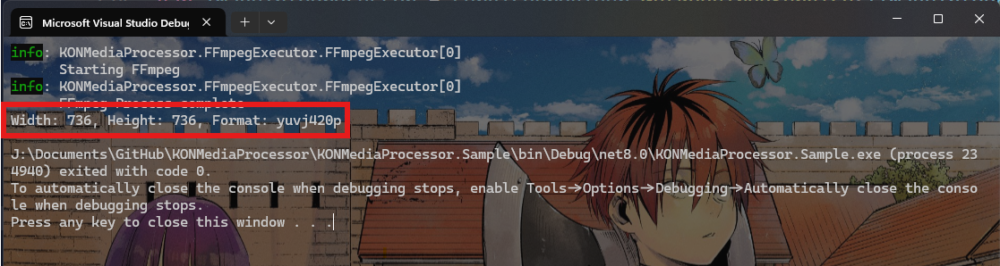
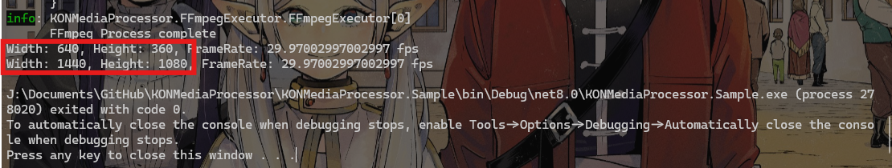
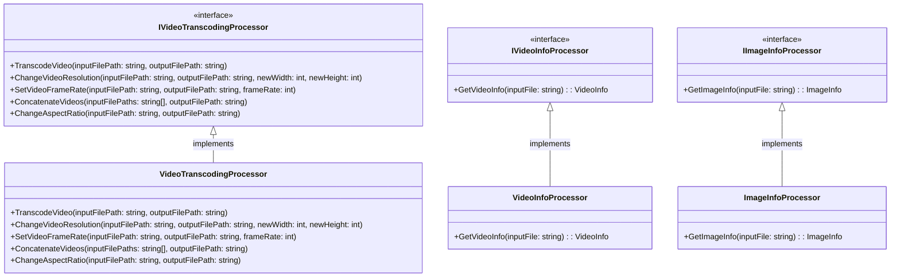

The objective of this post is to explain and show how to implement the Façade Pattern in a basic way.

## Pre-requisites

Check all the description and information related to the [Façade Pattern](/docs/structural-patterns/facade) and return here to see a practical example.

## Description

<div align="center">
  
  <p>Image taken from <a href="https://www.geeksforgeeks.org/facade-design-pattern-introduction/">GeekForGeeks</a></p>
</div>

Imagine that you want to process multimedia like videos and images using FFmpeg.

During your development you found that your library just executes FFmpeg and run a command, but your clients dont  like this idea because they manually needs to create the command and make all the validations to the file,
for example you want you Join two videos `intro.mp4` and `ending.mp4` but you need to validate that they have the same codecs, the same resolution, the output file `result.mp4` cannot exists, and the destination path the code has the right permissions.

<!--truncate-->

Thats a lot of process, at the end you have a huge pice of code like this:

```csharp
if (inputFilePaths == null || inputFilePaths.Length == 0)
{
    throw new ArgumentException("Input file paths cannot be null or empty.", nameof(inputFilePaths));
}

if (string.IsNullOrEmpty(outputFilePath))
{
    throw new ArgumentNullException(nameof(outputFilePath));
}

ValidatePaths(inputFilePaths, outputFilePath, overrideFile);
_fileValidator.EnsureDirectoryPathExists(outputFilePath);
var firstVideoInfo = _videoInfoProcessor.GetVideoInfo(inputFilePaths[0]);
for (int i = 1; i < inputFilePaths.Length; i++)
{
    var videoInfo = _videoInfoProcessor.GetVideoInfo(inputFilePaths[i]);
    if (videoInfo.Width != firstVideoInfo.Width || videoInfo.Height != firstVideoInfo.Height)
    {
        throw new DifferentResolutionsException("Videos have different resolutions. Concatenation is not supported.");
    }
}
string inputFiles = string.Join(" ", inputFilePaths.Select(path => $"-i \"{path}\""));
var arguments = $" {inputFiles} -filter_complex \"";

if (includeAudio)
{
    for (int i = 0; i < inputFilePaths.Length; i++)
    {
        var videoInfo = _videoInfoProcessor.GetVideoInfo(inputFilePaths[i]);
        arguments += $"[{i}:v] [{i}:a]";
    }
    arguments += $" concat=n={inputFilePaths.Length}:v=1:a=1 [v] [a]\"";
}
else
{
    for (int i = 0; i < inputFilePaths.Length; i++)
    {
        arguments += $"[{i}:v]";
    }
    arguments += $" concat=n={inputFilePaths.Length}:v=1 [v]\"";
}

arguments += $" -map \"[v]\"";
if (includeAudio)
{
    arguments += $" -map \"[a]\"";
}
arguments += $" \"{outputFilePath}\"";
arguments += overrideFile ? " -y" : " -n";
var result = _executor.ExecuteCommand(FFmpegConfig.GetFFmpegLocation(), arguments);
if (!string.IsNullOrEmpty(result) && result.Contains("Error:"))
{
    throw new FFmpegException($"Error concatenating videos: {result}");
}
```

Thats a lot of code there are too many things to do just for joining videos, and your clients the developers that want to use your library dont expect make everthing,
they just need to join videos they dont want to know what happens inside your code to do something like that, they just want to use:

```csharp
var paths = new string[] { "G:\\Videos\\intro.mp4", "J:\\Downloads\\ending.mp4" };
videoTranscoder.ConcatenateVideos(paths, "J:\\Documents\\result.mp4", overrideFile: true);
```

## How to put it into practice?

You have to create a common class or interface where you expose all the definitions of your methods but not the implementation, in the current example we have the `VideoTranscodingProcessor` which implements the `IVideoTranscodingProcessor` 
your users don't want to know what the `VideoTranscodingProcessor` contains they just want to use the `IVideoTranscodingProcessor` and call its methods.

### Code Implementation

To implement this pattern you have to define your common interface in this case the `IVideoTranscodingProcessor` that's our façade 

```csharp
public interface IVideoTranscodingProcessor
{
    void TranscodeVideo(string inputFilePath, string outputFilePath, VideoCodec videoEncoder = VideoCodec.H264, AudioCodec audioEncoder = AudioCodec.AAC, int audioBitrate = 128, bool overrideFile = false);
    void ChangeVideoResolution(string inputFilePath, string outputFilePath, int newWidth, int newHeight, bool overrideFile = false);
    void SetVideoFrameRate(string inputFilePath, string outputFilePath, int frameRate, bool overrideFile = false);
    void ConcatenateVideos(string[] inputFilePaths, string outputFilePath, bool includeAudio = true, bool overrideFile = false);
    void ChangeAspectRatio(string inputFilePath, string outputFilePath, AspectRatio aspectRatio, bool overrideFile = false);
}
```

After that you have to create your implementation of the facade in our example is the `VideoTranscodingProcessor` that has all the logic like validation, calling external services, create the commands and execute the command.

:::note
Please visit the source code for the implementation of [VideoTranscodingProcessor](https://github.com/egonzalezt/KONMediaProcessor/blob/main/KONMediaProcessor/VideoProcessor/VideoTranscoding/VideoTranscodingProcessor.cs)

[Source Code](https://github.com/egonzalezt/KONMediaProcessor/)
:::

Finally we have the client this is the responsible of calling our façades and calling the methods

```csharp
var serviceCollection = new ServiceCollection();
ConfigureServices(serviceCollection);

var serviceProvider = serviceCollection.BuildServiceProvider();

var imageInfoProcessor = serviceProvider.GetRequiredService<IImageInfoProcessor>();
var videoTranscoder = serviceProvider.GetRequiredService<IVideoTranscodingProcessor>();
var videoInfoProcessor = serviceProvider.GetRequiredService<IVideoInfoProcessor>();
var imageInfo = imageInfoProcessor.GetImageInfo("J:\\Pictures\\31bff16c98b1fa974674d7d21e7c256a.jpg");
Console.WriteLine($"Width: {imageInfo.Width}, Height: {imageInfo.Height}, Format: {imageInfo.Format}");
videoTranscoder.ChangeVideoResolution("J:\\Downloads\\shooting star de rojas.mp4", "J:\\Downloads\\shooting.mp4", 1440, 1080, overrideFile: true);
var originalVideo = videoInfoProcessor.GetVideoInfo("J:\\Downloads\\shooting star de rojas.mp4");
var newVideo = videoInfoProcessor.GetVideoInfo("J:\\Downloads\\shooting.mp4");
Console.WriteLine(@originalVideo); 
Console.WriteLine(@newVideo);

void ConfigureServices(ServiceCollection services)
{

    services.AddLogging(configure =>
    {
        configure.AddConsole();
        configure.SetMinimumLevel(LogLevel.Information);
    });
    services.AddKONMediaProcessor();
}
```

<div align="center">
  [](./codeExecution.png)
</div>

<div align="center">
  [](./changeResolutionExample.png)
</div>

### Diagram



## References

* [Facade](https://refactoring.guru/design-patterns/facade)
* [FFmpeg](https://ffmpeg.org/)
* [ffmpeg Documentation](https://ffmpeg.org/ffmpeg.html)
* [Facade Method Design Pattern](https://www.geeksforgeeks.org/facade-design-pattern-introduction/)
