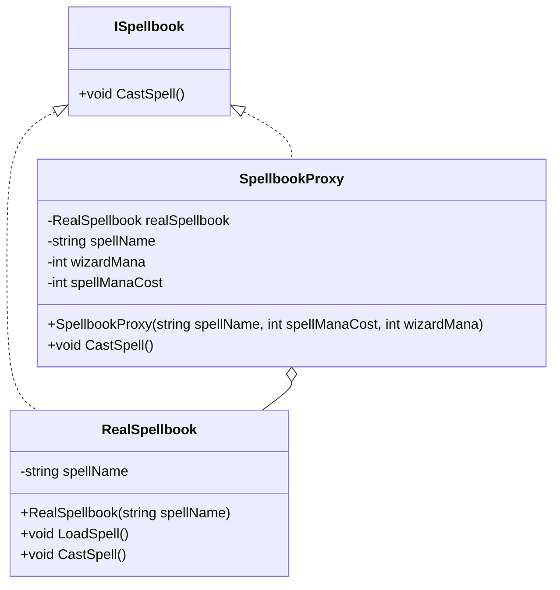

The objective of this post is to explain and show how to implement the Proxy Pattern in a basic way.

## Pre-requisites
Check all the description and information related to the [Proxy Pattern](/docs/structural-patterns/proxy) and return here to see a practical example.

## Description: The Magical World

Welcome to a magical world where wizards wield powerful spells from enchanted spellbooks. Each spellbook is a treasure trove of mystical knowledge, containing spells capable of performing wonders like summoning fireballs, controlling the weather, or even teleporting across vast distances. However, these spells come with certain conditions. A wizard needs sufficient mana (magical energy) to cast a spell, and some spells require the wizard to solve ancient riddles before they can be used.

<!--truncate-->

## The Problem: Chaotic Casting
In this magical realm, let's imagine we have a class Spellbook that allows wizards to cast spells. Initially, the wizards directly interact with these spellbooks. But soon, chaos ensues:

* **Insufficient Mana:** Wizards often try to cast powerful spells without having enough mana, leading to failed attempts and frustration.
* **Complex Spell Loading:** Each spell needs to be loaded before it can be cast, which is an expensive operation. Loading every spell at the start consumes a lot of resources and makes the system slow.
* **Riddle Requirements:** Some spells can only be cast if the wizard solves a riddle, but there's no check in place, leading to spells being cast without fulfilling the requirements.

The result is a system that's hard to manage, inefficient, and error-prone. Wizards are getting lost in the complexity, and the game's performance is suffering.

## The Solution: Enlisting the Proxy Pattern
Enter the Proxy pattern, the wizard's new best friend. The Proxy pattern provides a way to control access to the spellbooks, ensuring that spells are cast only when the necessary conditions are met. Here's how it works:

* **Controlled Access:** The proxy acts as a gatekeeper. Before allowing a spell to be cast, it checks if the wizard has enough mana.
* **Lazy Initialization:** The proxy only loads a spell when it's actually needed, saving resources and improving performance.
* **Condition Checks:** The proxy can enforce additional conditions, such as solving a riddle, before allowing the spell to be cast.

With the Proxy pattern, the system becomes much more manageable, efficient, and secure. Wizards can cast their spells smoothly without encountering the chaos of unmet conditions and unnecessary resource consumption.

## Implementation in C#

### Step 1: Define the Subject Interface
We start by defining an interface ``ISpellbook`` that both the real spellbook and the proxy will implement.

```csharp
public interface ISpellbook
{
    void CastSpell();
}
```
### Step 2: Implement the Real Subject (Real Spellbook)
The ``RealSpellbook`` class represents the actual spellbook containing the spells. It handles the expensive operation of loading spells and the actual spell casting.

```csharp
public class RealSpellbook : ISpellbook
{
    private string spellName;

    public RealSpellbook(string spellName)
    {
        this.spellName = spellName;
        LoadSpell();
    }

    private void LoadSpell()
    {
        Console.WriteLine($"Loading spell: {spellName}");
    }

    public void CastSpell()
    {
        Console.WriteLine($"Casting spell: {spellName}");
    }
}
```

### Step 3: Implement the Proxy
The SpellbookProxy class controls access to the RealSpellbook. It checks if the wizard has enough mana before allowing the spell to be cast. If the conditions are met, it creates the real spellbook and delegates the spell casting to it.

```csharp
public class SpellbookProxy : ISpellbook
{
    private RealSpellbook realSpellbook;
    private string spellName;
    private int wizardMana;
    private int spellManaCost;

    public SpellbookProxy(string spellName, int spellManaCost, int wizardMana)
    {
        this.spellName = spellName;
        this.spellManaCost = spellManaCost;
        this.wizardMana = wizardMana;
    }

    public void CastSpell()
    {
        if (wizardMana >= spellManaCost)
        {
            if (realSpellbook == null)
            {
                realSpellbook = new RealSpellbook(spellName);
            }
            realSpellbook.CastSpell();
        }
        else
        {
            Console.WriteLine($"Not enough mana to cast {spellName}. Mana required: {spellManaCost}, Mana available: {wizardMana}");
        }
    }
}
```

### Step 4: Use the Proxy in the Game
In the game, we create instances of SpellbookProxy instead of RealSpellbook. This ensures that the proxies control access to the real spellbooks, checking mana before allowing spell casting.

```csharp
class Program
{
    static void Main(string[] args)
    {
        int wizardMana = 50;

        ISpellbook fireballSpell = new SpellbookProxy("Fireball", 30, wizardMana);
        ISpellbook lightningSpell = new SpellbookProxy("Lightning Bolt", 60, wizardMana);

        fireballSpell.CastSpell(); // Should succeed
        lightningSpell.CastSpell(); // Should fail due to insufficient mana
    }
}
```

<iframe width="100%" height="475" src="https://dotnetfiddle.net/Widget/Pzo8lE" frameborder="0"></iframe>

[SourceCode](https://github.com/lbte/design-patterns/tree/main/code/structural-patterns/proxy)

### Diagram



## Conclusion 

The Proxy pattern is a perfect fit for our magical spellbook scenario, solving the issues of controlled access, resource management, and condition enforcement. By using a proxy, we ensure that wizards can only cast spells when they meet the necessary conditions, leading to a more stable and efficient game. This pattern can be applied to various other scenarios in software design where access control, lazy initialization, and additional operations are needed. With the Proxy pattern, our enchanted library of spells remains under control, and wizards can cast their spells without a hitch.