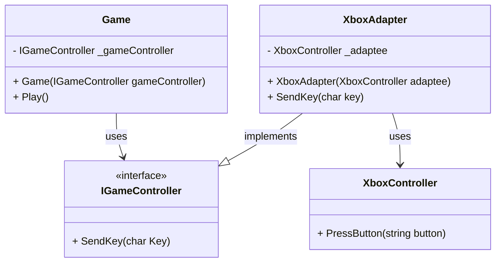

<div align="center" >
    
    </div>

The objective of this post is to explain and show how to implement the Adapter Pattern in a basic way.

## Pre-requisites
Check all the description and information related to the [Adapter Pattern](/docs/structural-patterns/adapter) and return here to see a practical example.

## Description

You're an avid gamer with a collection of controllers—Xbox, PlayStation, Nintendo, you name it. Each controller speaks a different "language" with unique button mappings and input methods. Your game, however, expects a single, unified interface to process these inputs. How can you make your Xbox controller work effortlessly with a game that was originally designed for a different controller?

## The solution

The Xbox Controller Adapter bridges the gap between the diverse Xbox controller interface and the standardized game controller interface expected by your game. By implementing the Adapter Pattern, we create a seamless translation layer that allows the Xbox controller to communicate perfectly with your game.

## How It Works:

### 1. Define the Game Controller Interface:
We start by defining a universal interface, IGameController, that includes the basic functionalities any game controller should have—button presses and joystick movements.

```csharp

public interface IGameController
{
    void SendKey(char key);
}

```

### 2. Adapting the Xbox Controller:
The Xbox controller has its unique methods for handling input. Our XboxControllerAdapter steps in to translate these unique methods into the standard IGameController interface.
```csharp

public class XboxAdapter : IGameController
{
    private readonly XboxController _adaptee;
    public XboxAdapter(XboxController adaptee)
    {
        this._adaptee = adaptee;
    }
    public void SendKey(char key)
    {
        string button = "";
        switch (key)
        {
            case 'w':
                button = "UP";
                break;
            case 's':
                button = "DOWN";
                break;
            case 'a':
                button = "LEFT";
                break;
            case 'd':
                button = "RIGHT";
                break;

        }
        _adaptee.PressButton(button);
    }
}

```

```csharp

public class XboxController
{
    public void PressButton(string button)
    {
        Console.WriteLine(button);
    }
}

```
### 3. Seamless Integration:
With the adapter in place, you can now use your Xbox controller as if it was designed for the game’s original controller interface. The adapter ensures all inputs are correctly translated and processed.
```csharp

public class Game
{
    private readonly IGameController _gameController;

    public Game(IGameController gameController)
    {
        _gameController = gameController;
    }
    public void Play()
    {
        _gameController.SendKey('a');
        _gameController.SendKey('w');
    }
}

class Program
{
    public static void Main()
    {
        XboxController xbox = new XboxController();
        IGameController gameController = new XboxAdapter(xbox);

        Game game = new Game(gameController);
        game.Play();
    }
}


```


In order to see the result of the code above, you can run the following code snippet:
<iframe width="100%" height="475" src="https://dotnetfiddle.net/Widget/RRStIa" frameborder="0"></iframe>

### Class Diagram


