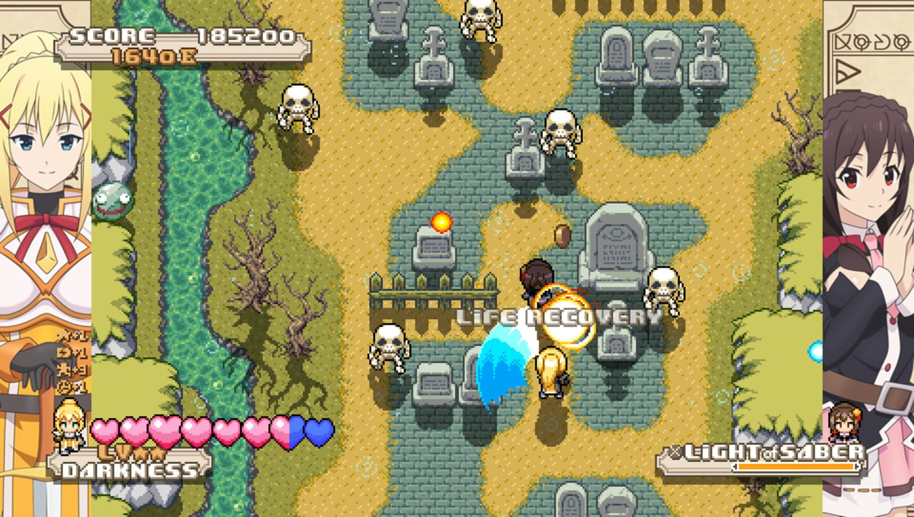
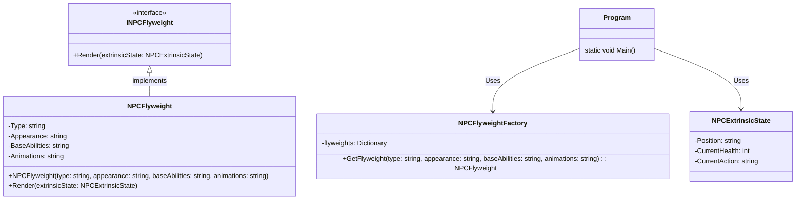
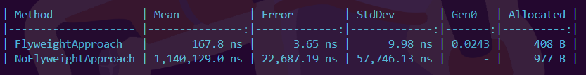

  
  
This image is part of the game この素晴らしい世界に祝福を！ Attack of the Destroyer developed by <a href="https://www.entergram.co.jp/konosuba/">Entergram</a>

The objective of this post is to explain and show how to implement the Flyweight Pattern in a basic way and see how this pattern can help you to reduce the memory usage of your applications.

<!--truncate-->

## Pre-requisites

Check all the description and information related to the [Flyweight Pattern](/docs/structural-patterns/flyweight) and return here to see a practical example.

## Description

Let's continue with the example given on the [Flyweight docs](/docs/structural-patterns/flyweight), Imagine we are developing a video game inspired by the popular anime "Konosuba". In this game, players control multiple main characters like Kazuma, Aqua, Darkness, and Megumin. During the latest release includes new enemies, Npcs, Allies, dungeons, levels, etc.
With this new release you received too many tickets where the users report that the game is crashing, when you check the analysis from the store all the users that reported the issue are users with less than `8Gb` of Ram.

When you start fixing the bug as soon as possible to avoid losing users, you discover that the game works as expected, no memory leaks, no problems with garbage collection, etc. After having no idea how to fix this problem, you discover that the enemies and dungeons added in the latest version consume too many resources. But the enemies are ok and the same with the dungeons. After trying to understand the reason you remember the flyweight pattern.
On our videogame we have playabe characters like `Darkness`, `Aqua`, `Kazuma`, `Megumin`, etc. Then we have the Non playable characters or `NPC` like Goblins, Villagers, Shopkeepers, etc. But all of them have common attributes with intrinsic states.

So you decide to implement this pattern on the NPC characters to reduce the memory usage.

## Code Implementation

To implement this pattern you will need:

* Flyweight Interface
* ConcreteFlyweight: It represents the shared (intrinsic) part of an NPC character.
* Flyweight Factory: Responsible for creating and managing Flyweight objects. It ensures that Flyweight objects are shared properly to minimize memory usage.
* Extrinsic State: Holds the extrinsic state of an NPC character. These attributes are specific to each instance and are provided to the Flyweight during rendering.

<iframe width="100%" height="475" src="https://dotnetfiddle.net/Widget/10VhvO" frameborder="0"></iframe>

This could be the original implementation of the code without Flyweight pattern

<iframe width="100%" height="475" src="https://dotnetfiddle.net/Widget/br73SZ" frameborder="0"></iframe>

### Results

When you implement this pattern you will have a notorious reduction of the memory usage of your applications

  
  
Implementing this pattern reduces you `569 bytes` more.

:::note
Please visit the [code](https://github.com/lbte/design-patterns/tree/main/code/structural-patterns/flyweight) implementation of the benchmark, also this result could be more notoriuos using another example that requires more memory like a real videogame.
:::

## Bonus

Why don't you apply the flyweight pattern on the other characters like `Darkness`, `Aqua`, `Megumin`, `Kazuma`, etc?

On the section [Flyweight cons](/docs/structural-patterns/flyweight#cons) we mention `Limited Flexibility` 
>  If each character in a game requires a unique set of graphical assets or abilities, the Flyweight pattern would not be applicable.

So in this case each playable character like `Darkness` or `Aqua` have some special attributes that cannot be generic like the animations, assets, abilities, etc. So if we implement this pattern here all the characters look like the same and that's not the idea.

but.... For the NPC or the enemies this feature is valid because we do not need to focus on making a skeleton or goblin enemy to be different, and they all have the same attributes perhaps. Also it's important to consider that in our game we have the same enemy multiple times but the playable character appears maximum one time because they can be played by the user or supporting the user.

  
  
This image is part of この素晴らしい世界に祝福を！ Season 2 produced by <a href="https://www.deen.co.jp/works/konosuba2">Studio Deen</a>

  
That's all folks, I hope you have learned about the Flyweight pattern from this small example.

