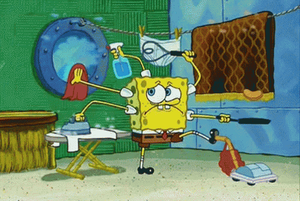

# Façade

Imagine you're building a smart home automation system that controls various devices such as lights, thermostats, and security cameras. Each device has its own complex interface and set of commands. Without a Façade Pattern, managing these devices directly in your code can quickly become overwhelming. For instance, turning on the lights might involve sending commands to different light bulbs, adjusting their brightness, and checking if any motion sensors need to be activated—all of which requires intricate coordination.

  
  
Image taken from <a href="https://tenor.com/view/spongebob-spongebob-squarepants-stressed-anxious-multi-tasking-gif-3581306">Tenor</a>

  
your face when you have to handle manually all your devices

Now, let's consider a simplified scenario where you want to implement a basic feature: turning on all the lights in your home. Where you might start by directly interacting with each individual light bulb object, setting its state to `on`, and adjusting it's brightness if needed. You'd repeat this process for every light bulb in your home, leading to repetitive and verbose code. Additionally, if the implementation of the light bulbs changes in the future, you'd need to update this code everywhere it's used.

However, by applying the Façade Pattern, you can create a LightController class. This class acts as a Façade, providing a simple method like `turnOnAllLights()`. Behind the scenes, the LightController class encapsulates the complexities of interacting with each individual light bulb. It knows how to communicate with the bulbs, adjust their brightness, and handle any other necessary tasks. From the perspective of the rest of your codebase, all you need to do is call the `turnOnAllLights()` method, greatly simplifying the process.

With the Façade Pattern in place, your code becomes more elegant and maintainable. If the implementation details of the light bulbs change, you only need to update the LightController class, rather than every part of your code that interacts with the bulbs. Additionally, the Façade hides the intricate details of working with the individual light bulbs, making your code easier to understand and reason about. By providing a unified interface to the complex subsystem of light bulbs, the Façade Pattern streamlines development and enhances the overall quality of your smart home automation system.

## Components

### Façade

The Façade is a class or interface that provides a simplified interface to the complex subsystem. It encapsulates the interactions with the subsystem's components behind a single, well-defined interface. The Façade delegates client requests to appropriate objects within the subsystem, coordinating their actions as necessary. In the example of the smart home automation system, the Façade could be represented by a class like `LightController`, which provides methods for controlling the lights.

### Client

The Client is the code that interacts with the Façade to perform tasks or access functionality provided by the subsystem. In the example, the client code would be any part of the smart home automation system that needs to control the lights. Instead of directly interacting with individual light bulbs, the client code interacts with the `LightController` Façade, making the interaction simpler and more intuitive.

### Additional Façade (optional)

In some cases, you might have multiple Façades within a system, each providing a simplified interface to a different aspect of the subsystem. These additional Façades can help further organize and simplify the codebase. For example, in the smart home automation system, we might have separate Façades for controlling thermostats, security cameras, and other devices.

## Pros

* **Simplified Interface**: The primary advantage of the Façade Pattern is that it provides a simplified interface to a complex subsystem. It **hides** the complexities of the subsystem's components behind a single, well-defined interface, making it easier for clients to use.

* **Decoupling**: By encapsulating the interactions with the subsystem's components, the Façade Pattern promotes loose coupling between the client code and the subsystem. This allows for greater flexibility and easier maintenance, as changes to the subsystem can be made without affecting the client code.

* **Encapsulation**: The Façade encapsulates the implementation details of the subsystem, allowing clients to interact with it at a higher level of abstraction. This improves code readability and reduces the risk of errors caused by directly manipulating the subsystem's components.

* **Promotes Reusability**: The Façade Pattern encourages the reuse of existing subsystem components by providing a unified interface to them. 

* **Simplifies Complex Systems**: In large software systems with multiple interacting components, the Façade Pattern can help simplify the overall architecture by providing a clear separation between the client code and the subsystem.

## Cons

* **Limited Customization**: The simplified interface provided by the Façade may not expose all of the capabilities of the underlying subsystem. This can limit the flexibility of the system and make it difficult to customize behavior for specific use cases.

* **Abstraction Leakage**: If the Façade is not well-designed, it may leak implementation details of the subsystem to the client code, defeating the purpose of encapsulation. This can lead to tighter coupling between the client and the subsystem, reducing the benefits of using the Façade Pattern.

* **Increased Complexity**: While the Façade Pattern simplifies the interface to the subsystem for clients, it can sometimes introduce additional complexity within the Façade itself.

* **Maintenance Overhead**: If the underlying subsystem changes frequently, maintaining the Façade to keep it in sync with the changes can become a significant overhead.
