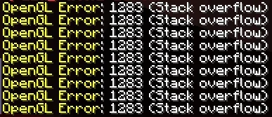

# Flyweight

Imagine you are developing a video game inspired by the popular anime "Konosuba". In this game, players control multiple main characters like Kazuma, Aqua, Darkness, and Megumin. As your game gains more popularity you decide to add new characters and enemies like Yun yun, Eris, Wiz, etc. When you release this new update you start receiving too many tickets from the users saying that the game stopped working or that it just crashed.

When you check the tickets from the users the system shows you the possible reasons of the failure, and you identify that all the tickets come from users that have less than 8Gb of Ram. 

  
  
Image taken from <a href="https://www.reddit.com/r/Minecraft/comments/qkahud/stack_overflow/">Reddit</a>

So, now how can you solve this issue?, what is the next step to release a new fix to avoid losing players in your game?

## Flyweight to the rescue

Flyweight pattern helps optimize memory usage by sharing as much data as possible with similar objects. This pattern is particularly useful when dealing with a large number of objects that share common data, if we analyze the video game each character has unique attributes but can share many common properties such as graphical appearance, animations, and base abilities.

## Key Concepts

### Intrinsic State

Shared state that is common across many objects and can be stored centrally. In our game, this could include the character’s graphical appearance, base abilities, and animations.

### Extrinsic State
 
State that varies between objects and is stored outside the shared object. This could include the character’s current position, health points, and specific actions.

## Components

### Flyweight

The Flyweight interface declares methods which accept the extrinsic state of the flyweight object as parameters.

* Role: Represents the interface or abstract class for flyweight objects. These objects contain the intrinsic state, which is shared among multiple objects.

### ConcreteFlyweight

A class that implements the Flyweight interface and stores intrinsic state.

* Role: Provides storage for the        `intrinsic` state and methods to operate on it, ensuring that this shared data is not duplicated.

### Flyweight Factory

A factory that manages a pool of flyweight objects.

* Role: Ensures the reuse of existing flyweights by checking if an instance with the required intrinsic state already exists. If not, it creates a new instance and stores it for future use.

### Context

A class that contains extrinsic state.

* Role: The context object contains information that is unique to each flyweight object instance. It is passed to the flyweight object methods to operate on the shared intrinsic state.

### Client
The client code that uses the Flyweight objects.
* Role: The client maintains references to the flyweight objects and computes or stores their extrinsic state. The client should use the Flyweight Factory to obtain flyweight objects instead of creating them directly.

## Pros and Cons of the Flyweight Pattern

### Pros

* Reduced Memory Usage: By sharing common parts of the state (intrinsic state) among multiple objects, the Flyweight pattern significantly reduces memory consumption.

* Improved Performance: Reduced memory usage often leads to better performance due to fewer memory allocations and better cache utilization.

* Centralized State Management: The Flyweight pattern centralizes the intrinsic state, making it easier to manage and update shared data.

* Scalability: The Flyweight pattern allows for a large number of objects to be managed efficiently.

### Cons

* Complexity in Implementation: Implementing the Flyweight pattern adds complexity to the codebase. It requires careful distinction between intrinsic and extrinsic states.

* Overhead of Context Management: The pattern requires the client or context to manage and pass extrinsic state to Flyweight objects, adding to the overall complexity and potential for errors.

* Limited Flexibility: Since Flyweight objects share intrinsic state, they are not suitable for objects that require unique intrinsic state. If each character in a game requires a unique set of graphical assets or abilities, the Flyweight pattern would not be applicable.
